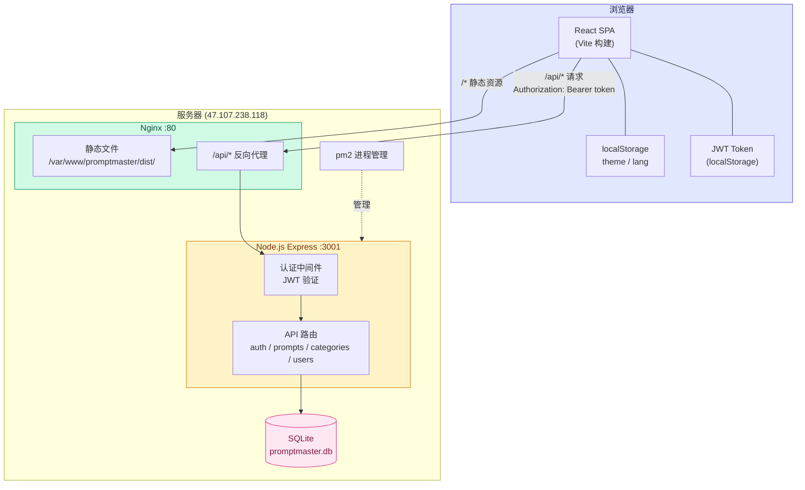

# PromptMaster

PromptMaster 是一个全栈 AI Prompt 管理系统，用于创建、组织、收藏和优化 AI 提示词。集成 Google Gemini API 提供 AI 驱动的 Prompt 优化与灵感生成功能。支持多用户、跨设备数据同步。

## 架构设计



## 功能特性

### Prompt 管理
- 创建、编辑、删除 Prompt，支持标题、内容、描述、分类、标签和可见性设置
- Prompt 收藏功能
- 一键复制 Prompt 内容到剪贴板
- 按分类、关键词、标签搜索和筛选
- 热门标签快捷筛选

### AI 能力
- **Prompt 优化** — 调用 Gemini API 对 Prompt 进行结构化优化，提升清晰度和效果
- **灵感生成** — 基于主题自动生成创意 Prompt 建议

### 多用户与权限
- 三种角色：`admin`（管理员）、`user`（普通用户）、`guest`（访客）
- 管理员可管理用户（添加 / 删除）
- 访客仅可浏览社区公开 Prompt
- 新用户首次登录强制修改密码
- Prompt 可见性控制（公开 / 私有）
- JWT 认证，跨设备数据同步

### 社区功能
- 公开 Prompt 在社区视图中对所有用户可见
- 私有 Prompt 仅创建者可见

### 分类系统
- 内置系统分类：编程、写作、图像生成、数据分析、学习、其他
- 支持自定义用户分类的增删

### 国际化与主题
- 中文 / 英文双语切换
- 亮色 / 暗色主题，支持跟随系统偏好
- 响应式设计，适配桌面与移动端

### 数据持久化
- 服务端 SQLite 数据库，跨设备数据共享
- 客户端偏好（主题 / 语言）保留在 localStorage

## 技术栈

| 类别 | 技术 |
|------|------|
| 前端框架 | React 19 + TypeScript |
| 构建工具 | Vite 6 |
| 样式 | Tailwind CSS |
| 图标 | lucide-react |
| AI | Google Gemini API (`gemini-3-flash-preview`) |
| 后端 | Express.js + Node.js |
| 数据库 | SQLite (better-sqlite3) |
| 认证 | JWT (jsonwebtoken) + bcryptjs |
| 进程管理 | pm2 |
| 反向代理 | Nginx |

## 项目结构

```
promptmaster/
├── App.tsx                  # 根组件，所有应用状态的单一数据源
├── index.tsx                # React 入口
├── index.html               # HTML 模板（Tailwind CDN、Import Maps）
├── types.ts                 # TypeScript 类型定义
├── components/
│   ├── Sidebar.tsx          # 侧边栏导航、分类、主题/语言切换
│   ├── PromptList.tsx       # Prompt 卡片网格展示
│   ├── PromptEditor.tsx     # Prompt 创建/编辑弹窗
│   ├── Login.tsx            # 登录页
│   ├── ChangePassword.tsx   # 首次登录修改密码
│   ├── UserManagement.tsx   # 用户管理弹窗（管理员）
│   ├── Toast.tsx            # 通知提示组件
│   └── Icon.tsx             # lucide-react 图标导出
├── services/
│   ├── api.ts               # 后端 API 客户端（JWT 自动附加）
│   └── geminiService.ts     # Gemini API 集成（优化 & 灵感生成）
├── utils/
│   ├── translations.ts      # 国际化翻译（zh/en）
│   └── generateId.ts        # 安全 UUID 生成（兼容非 HTTPS 环境）
├── server/
│   ├── package.json         # 服务端依赖
│   ├── index.js             # Express 入口，监听 127.0.0.1:3001
│   ├── db.js                # SQLite 初始化、建表、种子数据
│   ├── middleware/
│   │   └── auth.js          # JWT 验证中间件
│   └── routes/
│       ├── auth.js          # 登录、修改密码、获取当前用户
│       ├── prompts.js       # Prompt CRUD + 收藏切换
│       ├── categories.js    # 分类 CRUD
│       └── users.js         # 用户管理（仅管理员）
├── vite.config.ts           # Vite 构建配置（含 /api 代理）
├── tsconfig.json            # TypeScript 配置
└── package.json
```

## 快速开始

### 环境要求

- Node.js >= 18

### 安装与运行

```bash
# 安装前端依赖
npm install

# 安装服务端依赖
cd server && npm install && cd ..

# 配置 Gemini API Key（可选）
# 在 .env.local 文件中设置 GEMINI_API_KEY

# 启动后端服务（127.0.0.1:3001）
node server/index.js

# 启动前端开发服务器（0.0.0.0:3000，/api 自动代理到后端）
npm run dev

# 生产构建（输出到 dist/）
npm run build
```

### 环境变量

在项目根目录创建 `.env.local` 文件：

```
GEMINI_API_KEY=your_gemini_api_key_here
```

Vite 会在构建时将其注入为 `process.env.API_KEY` 和 `process.env.GEMINI_API_KEY`。

## API 端点

| 方法 | 路径 | 鉴权 | 说明 |
|------|------|------|------|
| POST | /api/auth/login | 无 | 登录，返回 JWT + user |
| GET | /api/auth/me | 需要 | 验证 token，返回当前用户 |
| POST | /api/auth/change-password | 需要 | 修改密码 |
| GET | /api/prompts | 需要 | 获取自己的 + 公开的 prompt |
| GET | /api/prompts/public | 无 | 访客获取公开 prompt |
| POST | /api/prompts | 需要 | 创建 prompt |
| PUT | /api/prompts/:id | 需要(owner) | 更新 prompt |
| DELETE | /api/prompts/:id | 需要(owner/admin) | 删除 prompt |
| POST | /api/prompts/:id/favorite | 需要 | 切换收藏状态 |
| GET | /api/categories | 无 | 获取所有分类 |
| POST | /api/categories | 需要 | 创建分类 |
| DELETE | /api/categories/:id | 需要(admin) | 删除分类 |
| GET | /api/users | 需要(admin) | 获取所有用户 |
| POST | /api/users | 需要(admin) | 创建用户 |
| DELETE | /api/users/:id | 需要(admin) | 删除用户 |

## 默认账户

| 用户名 | 密码 | 角色 |
|--------|------|------|
| Admin User | password | 管理员 |
| Jane Doe | password | 普通用户 |
| Guest | — | 访客（无需密码） |

管理员新建用户的默认密码为 `123456`，首次登录时强制修改。

## 部署

```bash
# 构建前端
npm run build

# 服务器上启动后端（pm2 管理）
cd server && pm2 start index.js --name promptmaster-api && pm2 save

# Nginx 配置 /api/ 反向代理到 127.0.0.1:3001
```

## License

MIT
