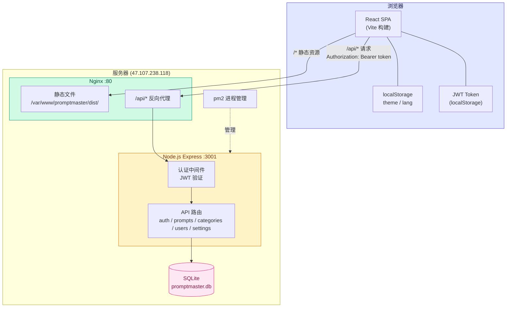

# PromptMaster

> 全栈 AI Prompt 管理平台 — 创建、组织、收藏、分享和复用 AI 提示词。支持多用户协作、社区共享、Fork 二创，跨设备数据同步。


## 架构设计



## 功能特性

### Prompt 管理
- 创建、编辑、删除 Prompt，支持标题、内容、描述、分类、标签和可见性设置
- Prompt 收藏功能，侧边栏「收藏」视图集中查看
- 一键复制 Prompt 内容到剪贴板（兼容 HTTP 环境）
- 按分类、关键词、标签搜索和筛选
- 热门标签快捷筛选
- 标签输入支持多种分隔符：逗号 `,` `，`、顿号 `、`、分号 `;` `；`、回车

### 社区与协作
- Prompt 可见性控制（公开 / 私有）
- 公开 Prompt 在社区视图中对所有用户可见
- **Fork 功能** — 基于他人公开 Prompt 一键创建自己的副本，自由修改

### 多用户与权限
- 三种角色：`admin`（管理员）、`user`（普通用户）、`guest`（访客）
- 管理员可管理用户（添加 / 删除），可编辑和删除任意 Prompt
- 普通用户管理自己的 Prompt，可 Fork 他人公开 Prompt
- 访客仅可浏览社区公开 Prompt
- 支持开放注册（管理员可控制开关）
- 新用户首次登录强制修改密码
- 用户可随时通过侧边栏菜单修改密码
- JWT 认证，跨设备数据同步
- 所有 Prompt 卡片始终显示创建者

### 分类系统
- 内置系统分类：编程、写作、图像生成、数据分析、学习、产品规划、架构设计、PPT制作、其他
- 支持自定义用户分类（侧边栏分类旁的 `+` 按钮）
- 点击分类显示该分类下自己的 + 公开的 Prompt

### 国际化与主题
- 中文 / 英文双语切换
- 亮色 / 暗色主题，支持跟随系统偏好
- 响应式设计，适配桌面与移动端

## 使用指南

### 核心概念

**分类 = 大场景**

分类用于划分大的应用场景，比如系统内置的：编程、写作、图像生成、数据分析、学习等。你也可以创建自定义分类（侧边栏「分类」旁的 `+` 按钮），比如「产品设计」「客服话术」「翻译」等。

**标签 = 灵活标记**

标签用于细粒度的交叉分类，一个 Prompt 可以打多个标签。推荐用标签来区分：

| 维度 | 标签示例 |
|------|----------|
| 应用/工具 | `chatgpt`、`claude`、`midjourney`、`cursor`、`copilot` |
| 语言 | `中文`、`english`、`日本語` |
| 技术栈 | `react`、`python`、`golang`、`sql`、`docker` |
| 用途 | `模板`、`调试`、`优化`、`翻译`、`总结` |

### 组合使用示例

| Prompt | 分类 | 标签 |
|--------|------|------|
| React 组件生成器 | 编程 | `react`, `typescript`, `chatgpt` |
| Python 数据清洗脚本 | 数据分析 | `python`, `pandas`, `claude` |
| Midjourney 人像提示词 | 图像生成 | `midjourney`, `portrait`, `english` |
| 英文邮件润色 | 写作 | `english`, `翻译`, `chatgpt` |
| Go 项目代码审查 | 编程 | `golang`, `claude`, `code-review` |

### 日常操作

- **创建 Prompt**：点击右上角「新建 Prompt」，填写标题、内容、选择分类，添加标签，设置公开或私有
- **搜索**：顶部搜索栏支持按标题、内容、标签模糊搜索，可配合分类下拉框进一步筛选
- **热门标签**：页面上方会显示使用最多的标签，点击即可快速筛选/取消
- **收藏**：点击 Prompt 卡片上的星标收藏，在侧边栏「收藏」视图集中查看
- **复制**：点击卡片上的复制按钮，或打开详情后点击内容区域右上角的复制图标
- **社区**：将 Prompt 设为「公开」后，所有用户都能在「社区」视图看到并复制使用
- **Fork**：看到他人的公开 Prompt 想修改？点击 Fork 图标，自动创建一份副本到自己名下
- **修改密码**：侧边栏底部用户菜单中选择「修改密码」

### 小技巧

- 标签输入时用逗号、顿号、分号分隔，可以一次添加多个标签；未按回车的标签在保存时自动提交
- 给常用 Prompt 加上统一前缀标签（如 `daily`），方便每日快速定位
- 私有 Prompt 只有自己能看到，适合存放包含敏感信息的 Prompt

## 技术栈

| 类别 | 技术 |
|------|------|
| 前端框架 | React 19 + TypeScript |
| 构建工具 | Vite 6 |
| 样式 | Tailwind CSS |
| 图标 | lucide-react |
| 后端 | Express.js + Node.js |
| 数据库 | SQLite (better-sqlite3) |
| 认证 | JWT (jsonwebtoken) + bcryptjs |
| 进程管理 | pm2 |
| 反向代理 | Nginx |

## 项目结构

```
promptmaster/
├── App.tsx                  # 根组件，所有应用状态的单一数据源
├── index.tsx                # React 入口
├── index.html               # HTML 模板（Tailwind CDN、Import Maps）
├── types.ts                 # TypeScript 类型定义
├── components/
│   ├── Sidebar.tsx          # 侧边栏导航、分类、主题/语言切换
│   ├── PromptList.tsx       # Prompt 卡片网格 + 详情弹窗（含 Fork）
│   ├── PromptEditor.tsx     # Prompt 创建/编辑/Fork 弹窗
│   ├── Login.tsx            # 登录 / 注册页
│   ├── ChangePassword.tsx   # 修改密码（首次登录强制 / 用户主动）
│   ├── UserManagement.tsx   # 用户管理弹窗（管理员）
│   ├── Toast.tsx            # 通知提示组件
│   └── Icon.tsx             # lucide-react 图标导出
├── services/
│   └── api.ts               # 后端 API 客户端（JWT 自动附加）
├── utils/
│   ├── translations.ts      # 国际化翻译（zh/en）
│   └── generateId.ts        # 安全 UUID 生成（兼容非 HTTPS 环境）
├── server/
│   ├── package.json         # 服务端依赖
│   ├── index.js             # Express 入口，监听 127.0.0.1:3001
│   ├── db.js                # SQLite 初始化、建表、种子数据
│   ├── middleware/
│   │   └── auth.js          # JWT 验证中间件
│   └── routes/
│       ├── auth.js          # 登录、注册、修改密码、获取当前用户
│       ├── prompts.js       # Prompt CRUD + 收藏切换
│       ├── categories.js    # 分类 CRUD
│       ├── users.js         # 用户管理（仅管理员）
│       └── settings.js      # 应用设置（注册开关）
├── vite.config.ts           # Vite 构建配置（含 /api 代理）
├── tsconfig.json            # TypeScript 配置
└── package.json
```

## 快速开始

### 环境要求

- Node.js >= 18

### 安装与运行

```bash
# 安装前端依赖
npm install

# 安装服务端依赖
cd server && npm install && cd ..

# 启动后端服务（127.0.0.1:3001）
node server/index.js

# 启动前端开发服务器（0.0.0.0:3000，/api 自动代理到后端）
npm run dev

# 生产构建（输出到 dist/）
npm run build
```

## API 端点

| 方法 | 路径 | 鉴权 | 说明 |
|------|------|------|------|
| POST | /api/auth/login | 无 | 登录，返回 JWT + user |
| POST | /api/auth/register | 无 | 注册（需开放注册） |
| GET | /api/auth/me | 需要 | 验证 token，返回当前用户 |
| POST | /api/auth/change-password | 需要 | 修改密码 |
| GET | /api/prompts | 需要 | 获取自己的 + 公开的 prompt |
| GET | /api/prompts/public | 无 | 访客获取公开 prompt |
| POST | /api/prompts | 需要 | 创建 prompt |
| PUT | /api/prompts/:id | 需要(owner/admin) | 更新 prompt |
| DELETE | /api/prompts/:id | 需要(owner/admin) | 删除 prompt |
| POST | /api/prompts/:id/favorite | 需要 | 切换收藏状态 |
| GET | /api/categories | 无 | 获取所有分类 |
| POST | /api/categories | 需要 | 创建分类 |
| DELETE | /api/categories/:id | 需要(admin) | 删除分类 |
| GET | /api/users | 需要(admin) | 获取所有用户 |
| POST | /api/users | 需要(admin) | 创建用户 |
| DELETE | /api/users/:id | 需要(admin) | 删除用户 |
| GET | /api/settings | 无 | 获取注册开关状态 |
| PUT | /api/settings | 需要(admin) | 更新设置 |

## 默认账户

| 用户名 | 密码 | 角色 |
|--------|------|------|
| Admin User | password | 管理员 |
| Guest | — | 访客（无需密码） |

管理员新建用户的默认密码为 `123456`，首次登录时强制修改。

## 部署

```bash
# 构建前端
npm run build

# 服务器上启动后端（pm2 管理）
cd server && pm2 start index.js --name promptmaster-api && pm2 save

# Nginx 配置：
# - 静态文件指向 /var/www/promptmaster/dist/
# - /api/* 反向代理到 127.0.0.1:3001
```

## License

MIT
